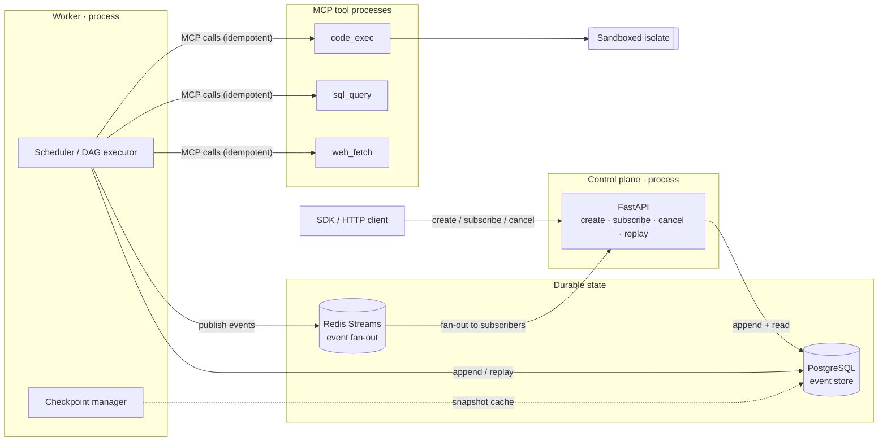

<div align="center">

# ⚙️ agent-runtime

**A durable-execution engine for LLM multi-agent systems.**

*Not a wrapper around LangChain or CrewAI — the lower-level runtime such frameworks would sit on top of.*
*Closer in spirit to Temporal / Cadence than to an agent library: a workflow core that happens to schedule LLM work.*

<br/>


</div>

---

## Table of contents

- [Why this exists](#why-this-exists)
- [Capabilities](#capabilities)
- [Architecture at a glance](#architecture-at-a-glance)
- [Repository layout](#repository-layout)
- [Getting started](#getting-started)
- [Roadmap](#roadmap)

---

## Why this exists

Real agents run for minutes to hours, crash mid-execution, call external tools
with side effects, burn tokens that cost money, and must leave an audit trail a
human can trust. `agent-runtime` treats those as **first-class engineering
problems**, not afterthoughts:

> Kill the process at any point, restart it, and the run resumes from its last
> committed event — with idempotent tool dispatch so side effects don't double-fire.

---

## Capabilities

| | |
|---|---|
| 🧱 **Durable execution** | Every run is an event-sourced state machine in PostgreSQL. Resume from the last committed event, zero data loss. |
| 🕸️ **DAG-based planning** | Agents emit an append-only task graph the runtime schedules — typed I/O, dependencies, retry policies, per-node cost budgets, bounded self-reflection cycles. |
| 🔌 **Tools over MCP** | External capabilities run as separate MCP tool processes. No tool logic in the agent process. |
| 🛡️ **Sandboxed code exec** | Generated code runs in a swappable isolate — light subprocess backend for dev/CI, heavy isolate in production. Never `exec()` in-process. |
| 🌊 **Streaming + backpressure** | Subscribers get typed events over Redis Streams; a slow client never stalls the agent. |
| 💰 **Cost & token accounting** | Every LLM and tool call records tokens, latency, and dollar cost per run / agent / tenant, with budget enforcement. |
| 🔭 **Full observability** | OpenTelemetry spans on every event and call; every run reconstructible from its event log alone. |

---

## Architecture at a glance



The **control plane** and the **worker** are separate processes that share
nothing but PostgreSQL and Redis — so they scale and fail independently.

---

## Repository layout

| Package    | Role                                                          |
|------------|--------------------------------------------------------------|
| `runtime/` | Core engine: event store, scheduler, checkpoints, streaming  |
| `api/`     | FastAPI control plane (create · subscribe · cancel · replay)  |
| `agents/`  | Reference agents (executor · critic · verifier · planner)     |
| `tools/`   | Reference MCP tool servers (web_fetch · code_exec · sql_query)|
| `sdk/`     | Thin Python client SDK                                        |
| `bench/`   | Reproducible benchmarks                                       |
| `docs/`    | Architecture decisions (ADR), sequence diagrams, schemas     |

Managed as a [uv](https://docs.astral.sh/uv/) workspace — one member package per deliverable.

---

## Getting started

Requires **[uv](https://docs.astral.sh/uv/)** and **Docker**.

```sh
make install          # sync workspace + dev tools
cp .env.example .env  # then edit as needed
make up               # start Postgres, Redis, OTEL, Prometheus
make lint typecheck   # ruff + strict mypy
make test             # unit tests
make test-integration # integration tests (real infra via testcontainers)
```

Run `make help` for the full list of targets.

---

## Roadmap

Built in strict phase order — no phase begins before the previous one lands.

- [x] **1 · Skeleton** — uv workspace, tooling, CI shape
- [ ] **2 · Event store** — schema, append/read/replay, property-based tests
- [ ] **3 · Run state machine** + checkpoint manager
- [ ] **4 · Scheduler** + DAG executor
- [ ] **5 · LLM provider interface** + cost accounting
- [ ] **6 · MCP tool client** + sandboxed code executor
- [ ] **7 · Streaming bus** + FastAPI control plane
- [ ] **8 · Reference agents** (executor / critic / verifier)
- [ ] **9 · Observability** (OTEL + Prometheus + dashboards)
- [ ] **10 · Benchmarks** + docs + ADRs

<div align="center">
<sub>Architecture decisions are recorded under <code>docs/adr/</code>.</sub>
</div>
