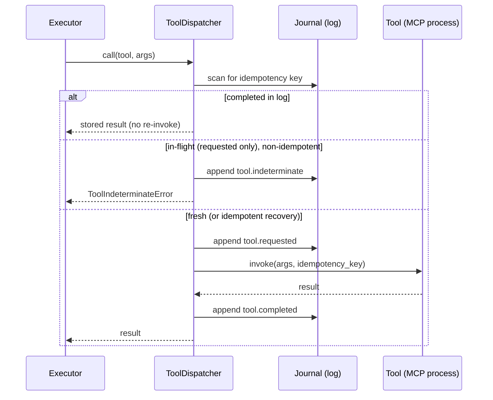
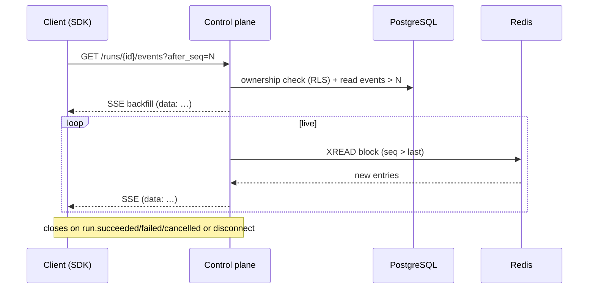

# Sequence diagrams

Key flows through the runtime. Diagrams render natively on GitHub.

## Durable append and crash recovery

```mermaid
sequenceDiagram
    participant W as Worker (lease holder)
    participant RS as RunStore
    participant DB as PostgreSQL
    participant R as Redis
    W->>RS: append_events(lease, payloads)
    RS->>DB: FOR UPDATE runs; verify fencing token
    alt token stale
        RS-->>W: StaleLeaseError
    else token current
        RS->>DB: INSERT events (seq = last+1 …), UPDATE projection
        RS->>R: publish (best-effort)
        RS-->>W: envelopes
    end
    Note over W,DB: 💥 process dies
    W->>RS: load_state on restart
    RS->>DB: latest snapshot + events after it
    RS-->>W: folded RunState (resume)
```

## Durable tool dispatch and recovery



## Live subscription (backfill + tail)



## CEV reflection loop

```mermaid
sequenceDiagram
    participant S as Scheduler
    participant X as CEVExecutor
    S->>X: run executor node
    X-->>S: proposal
    S->>X: run critic node (typed constraints)
    alt constraints pass
        X-->>S: spawn verifier
        S->>X: run verifier
        X-->>S: result → run SUCCEEDED
    else constraints fail
        X-->>S: spawn executor+critic (depth+1, with feedback)
        Note over S,X: scheduler enforces max_reflection_depth;<br/>exceeding → MaxReflectionDepthError → run FAILED
    end
```
